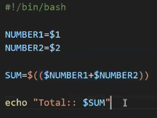

## session 12 Into to shell scripting
- [session 12 Into to shell scripting](#session-12-into-to-shell-scripting)
- [Git 19:35](#git-1935)
  - [Git 20:15](#git-2015)
  - [Git 23:20](#git-2320)
- [34:30 creating a server and pushing to the server](#3430-creating-a-server-and-pushing-to-the-server)
- [variables 42:38](#variables-4238)
- [56:00 arguments](#5600-arguments)
- [how DB connection programs use shell script to hide password](#how-db-connection-programs-use-shell-script-to-hide-password)
- [1:05:04 data types](#10504-data-types)
- [arrays in shell script](#arrays-in-shell-script)
- [adding numbers](#adding-numbers)
- [not this calss program](#not-this-calss-program)


repo links
`https://github.com/daws-76s/shell-script`

till 17 min pushing to repo
18 cloning is always done in https 

## Git 19:35
writing code 

initialising repository using git

`git init`

checking status of git repository 

`git status`

adding files to git repository

`git add.`

committing files to git repository

`git commit -m "first commit"`

pushing files to git repository

`git push -u origin master`


### Git 20:15
pulling files from git repository

`git pull`

log of git repository

`git log`


### Git 23:20


using existing repository to push files to git repository

adding remote origin to git repository

`git remote add origin https://github.com/username_0/git-demo.git`

when you add origin and push data to git repository it will automatically existing commits

`git push -u origin master`


writing script files

script file strts with shebang

`#!/bin/bash`

this contains location of bash

Comment starts with #

`# this is a comment`

echo is used to print something on screen

`echo "hello world"`

commit a git commit
    
`git commit -m "first commit"`

pull changes from git repository

`git pull`

push a git commit

`git push -u origin master`

## 34:30 creating a server and pushing to the server

use https to clone the data from git repository

## variables 42:38

explain the following code 

#!/bin/bash

PERSON1=Robert
PERSON2=Raheem

echo "$PERSON1: Hello $PERSON2, Good Morning"
echo "$PERSON2: Hi $PERSON1, very Good Morning"
echo "$PERSON1: How are you $PERSON2?"
echo "$PERSON2: I am good $PERSON1, How are you"

Let's break down this simple Bash script:

**What the Code Does**

This script simulates a short conversation between two people named Robert (PERSON1) and Raheem (PERSON2). It uses variables to store the names and then prints out greetings and questions as if they were speaking to each other.

**Explanation Line by Line**

1. **`PERSON1=Robert`:**
   - This line creates a variable named `PERSON1` and assigns it the value "Robert". In Bash, variables are defined without needing to specify a data type.

2. **`PERSON2=Raheem`:**
   - Similarly, this line creates a variable named `PERSON2` and assigns it the value "Raheem".

3. **`echo "$PERSON1: Hello $PERSON2, Good Morning"`:**
   - `echo` is a command used to print text to the console. 
   - The text within double quotes (`"`) is treated as a string.
   - `$PERSON1` and `$PERSON2` are variables, and their values ("Robert" and "Raheem") are substituted into the string when it's printed. 
   - The output of this line would be: `Robert: Hello Raheem, Good Morning`

4. **`echo "$PERSON2: Hi $PERSON1, very Good Morning"`:**
   - Similar to the previous line, this prints a greeting from Raheem to Robert. 
   - Output: `Raheem: Hi Robert, very Good Morning`

5. **`echo "$PERSON1: How are you $PERSON2?"`:**
   - Robert asks Raheem how he is doing.
   - Output: `Robert: How are you Raheem?`

6. **`echo "$PERSON2: I am good $PERSON1, How are you"`:**
   - Raheem responds and asks Robert how he is doing.
   - Output: `Raheem: I am good Robert, How are you`


**Key Points**

* **Variables:** Variables are used to store values that you can use throughout your script. They make it easier to manage and change data.
* **`echo`:**  The `echo` command is a fundamental tool for displaying output.
* **Double Quotes:**  Double quotes around strings allow you to include variables within them, and the variable values are replaced in the output. 
* **String Concatenation:** While not explicitly used here, you can combine multiple strings and variables within `echo` to create more complex output (e.g., `echo "Hello, my name is $PERSON1 and I am $AGE years old."`).


#!/bin/bash

DATE=$(date)

echo "Script started executing: ${DATE}"

Absolutely! Let's break down this simple Bash script:

**Purpose**

This script's primary function is to print the current date and time to the console, along with a message indicating when the script began executing.

**Explanation Line by Line**

1. **`#!/bin/bash`:**
   - This is called a "shebang" and is crucial for making the script executable.
   - It tells the operating system to use the Bash shell (`/bin/bash`) to interpret and run the following commands.

2. **`DATE=$(date)`:**
   - This line does two things:
     - It runs the `date` command, a standard Unix/Linux utility that outputs the current date and time in various formats.
     - It captures the output of the `date` command (the current date and time) and stores it in a variable named `DATE`. This variable can now be used throughout the script.

3. **`echo "Script started executing: ${DATE}"`:**
   - `echo` is used to print text to the console (your terminal).
   - The text within double quotes (`"`) is a string literal.
   - `${DATE}` is a variable reference. It substitutes the actual value of the `DATE` variable (the current date and time) into the string when it's printed.
   - The result is a message like: "Script started executing: Sat May 11 19:36:56 IST 2024"

**How to Use It**

1. **Save:** Save this code in a file with a `.sh` extension (e.g., `script.sh`).
2. **Make Executable:** In your terminal, run `chmod +x script.sh` to give the file execution permissions.
3. **Run:** Execute the script by typing `./script.sh` in your terminal. You'll see the output message with the current date and time.

**Key Points**

* **Variables:** Variables in Bash (like `DATE`) hold values you can reuse throughout your script. The `$` is used to reference a variable's value.
* **Command Substitution:** The `$(...)` syntax lets you capture the output of a command and use it elsewhere (like assigning it to a variable).
* **Shebang:** The `#!` (shebang) line is crucial for identifying the interpreter to use for the script. 

Let me know if you'd like a more advanced example or have any further questions!


## 56:00 arguments

#!/bin/bash

PERSON1=$1
PERSON2=$2

echo "$PERSON1: Hello $PERSON2, Good Morning"
echo "$PERSON2: Hi $PERSON1, very Good Morning"
echo "$PERSON1: How are you $PERSON2?"
echo "$PERSON2: I am good $PERSON1, How are you"


Absolutely! Let's break down this Bash script and illustrate it with example arguments.

**Script Explanation**

This script is a slightly modified version of the previous conversation script.  The key difference is that it now takes the names of the two people as command-line arguments, making it more flexible.

* **`#!/bin/bash`:**  The shebang line, indicating that this script should be interpreted by the Bash shell.
* **`PERSON1=$1`:** This line assigns the first command-line argument (what you type after the script name) to the variable `PERSON1`.
* **`PERSON2=$2`:** This line assigns the second command-line argument to the variable `PERSON2`.
* **`echo ...`:** The remaining lines are identical to the previous script. They use the `PERSON1` and `PERSON2` variables to print out the conversation.

**Example Usage**

Let's say you save this script as `conversation.sh`. Here's how you would use it:

1. **Make it executable:**
   ```bash
   chmod +x conversation.sh
   ```

2. **Run with arguments:**
   ```bash
   ./conversation.sh Alice Bob
   ```
   
**Output:**

The script will output the following conversation:

```
Alice: Hello Bob, Good Morning
Bob: Hi Alice, very Good Morning
Alice: How are you Bob?
Bob: I am good Alice, How are you
```

**Key Points**

* **Command-Line Arguments:** These are extra pieces of information you provide to the script when you run it. Bash scripts access them using special variables:
    - `$1`: First argument
    - `$2`: Second argument
    - `$3`, `$4`, etc.:  For additional arguments
* **Flexibility:** By taking arguments, this script becomes more reusable. You can have conversations between any two people just by changing the arguments you pass.


## how DB connection programs use shell script to hide password 

#!/bin/bash

echo "Please enter your username:: "

read -s USERNAME #the value entered above will be automatically atteched to USERNAME variable

echo "Please enter your Password:: "
read -s PASSWORD

echo "Username is: $USERNAME, Password is: $PASSWORD" # I am priting just for validation, you should not print username and passwords in scripts

read command is to read the value from console


read -s USERNAME #the value entered above will not be visible

## 1:05:04 data types
**there are no data types in shell**

## arrays in shell script

#!/bin/bash

FRUITS=("Apple" "Banana" "Mango")

echo "First value: ${FRUITS[0]}"

echo "Second value: ${FRUITS[1]}"

echo "Second value: ${FRUITS[2]}"

echo "All Fruits: ${FRUITS[@]}"

## adding numbers



Absolutely! Let's break down this Bash script.

**Explanation**

1. **Shebang (#! /bin/bash):**
   * This is the first line and a special marker. It tells the operating system to use the Bash shell to execute the script.

2. **Input Arguments:**
   * `NUMBER1=$1`:  The script takes the first command-line argument (`$1`) and assigns it to a variable called `NUMBER1`.
   * `NUMBER2=$2`: The script takes the second command-line argument (`$2`) and assigns it to a variable called `NUMBER2`.

3. **Calculation:**
   * `SUM=$(($NUMBER1+$NUMBER2))`: This line calculates the sum of the two numbers. Here's how it works:
      - The double parentheses `((...))` are used for arithmetic operations in Bash.
      - `$NUMBER1` and `$NUMBER2` are replaced with their actual values.
      - The result of the addition is stored in the `SUM` variable.

4. **Output:**
   * `echo "Total:: $SUM"`: This line prints the result to the console.
      - `"Total:: "` is a fixed string.
      - `$SUM` is replaced with the calculated sum.

**How to Use It**

1. **Save:** Save the code as a file (e.g., `sum.sh`).
2. **Permissions:** Make the file executable: `chmod +x sum.sh`
3. **Run:** Execute the script, providing two numbers as arguments:
   ```bash
   ./sum.sh 15 20 
   ```
   This would output: `Total:: 35`

**Key Improvements**

Here's how this script could be improved for better error handling:

```bash
#!/bin/bash

# Check if enough arguments are provided
if [ $# -ne 2 ]; then
  echo "Usage: $0 <number1> <number2>"
  exit 1  # Exit with an error code
fi

NUMBER1=$1
NUMBER2=$2

# Check if the arguments are actually numbers
if ! [[ $NUMBER1 =~ ^[0-9]+$ ]] || ! [[ $NUMBER2 =~ ^[0-9]+$ ]]; then
  echo "Error: Please provide valid numbers"
  exit 1
fi

SUM=$(($NUMBER1+$NUMBER2))
echo "Total:: $SUM"
```
**Explanation of Improvements:**
* First checks whether two arguments are provided and provides usage instructions otherwise
* Uses regular expressions to check whether the arguments provided are integers

## not this calss program
#!/bin/bash

NUMBER=$1

if [ $NUMBER -gt 100 ]
then
   echo "Give number $NUMBER is greater than 100"
else
   echo "Give number $NUMBER is not greater than 100"
fi


end of class  1:20 08
