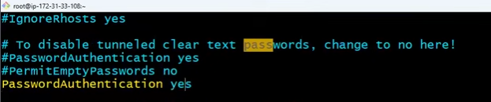
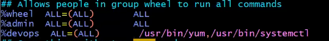

- [Session - 04](#session---04)
  - [Recap](#recap)
  - [agenda](#agenda)
  - [5:30 Service management](#530-service-management)
  - [algorithm](#algorithm)
  - [13:00 server creation](#1300-server-creation)
  - [14:51 connecting to server](#1451-connecting-to-server)
  - [18:00 nginx installation](#1800-nginx-installation)
  - [service](#service)
  - [Network management](#network-management)
  - [22:53 troubleshooting process](#2253-troubleshooting-process)
    - [System resources checking](#system-resources-checking)
    - [Telnet](#telnet)
    - [Telnet flags](#telnet-flags)
    - [to check if system is breathing network](#to-check-if-system-is-breathing-network)
    - [33:50 heavy RAM usage](#3350-heavy-ram-usage)
  - [34:25 How to give access to linux user](#3425-how-to-give-access-to-linux-user)
    - [providing sudo access to a group called admin](#providing-sudo-access-to-a-group-called-admin)
    - [login to new admin instead of ec2-user](#login-to-new-admin-instead-of-ec2-user)
    - [providing limited access to user](#providing-limited-access-to-user)
    - [Limited sudo access](#limited-sudo-access)
    - [47:00 sudoers.d](#4700-sudoersd)
  - [51:07 3 tier architecture](#5107-3-tier-architecture)
    - [Restaurant scenario](#restaurant-scenario)
    - [Front End, Backend](#front-end-backend)
    - [1:15:00 Q and A](#11500-q-and-a)


# Session - 04
--------------
## Recap
--------
**permissions**
    -read, write, execute numbers  
    -Group permissions and group access  
    -user management (providing access using ssh and password)  
    -deleting users and groups  
    - foreground and background process (&)
    - killing process using pid  
    - force killing the process (using -9)  
    - checking process status - `ps -ef | grep nodejs`  
    - package management  
## agenda 
    - providing sudo access to user and specific commands
    - process management
    - ## 5:30 Service management
## 5:30 Service management

Story:  
> When you are shipping a package from Delhi --> Hyd we will write To address as below
> To address     
> D.No: 123, 2nd floor  
> Tirumala apartment  
> Hitech city  
> Hyderabad  
> 600082  
>
> If we wont write City name and pincode shipping cannot start from Delhi
> No pincode and city - Stuck at Origin city
> No Area name - stuck at Destination city
> No Apartment name - Stuck at Area 
> No door name - stuck at apartment
> 
All Electronic computers have 0 - 65,635 ports  
If we are navigating to https://facebook.com   
`ssh -i <privatekey> username@Host-ip`  
A server is similar to a building and it has certain logical blocks  
ssh = port 22 which is a part of building, if ssh is not specified the request will reach  the computer but the request doesn't know where will it reach ( because of 0-65,635 available ports)  

## algorithm

1. generate key
2. public key import
3. firewall creation
4. ssh connection  
 Debug port by port to fix connection issues 

**When you face errors think slowly and clearly from basics, it will make clear that what was the error**

## 13:00 server creation

**popular port numbers**

1. SSH - Port 22
2. HTTP - Port 80
3. HTTPS - Port 443
4. FTP - Port 21
5. SMTP - Port 25
6. POP3 - Port 110
7. IMAP - Port 143
8. DNS - Port 53
9. LDAP - Port 389
10. MySQL - Port 3306

## 14:51 connecting to server

we are able to connect to ssh since its already running in the server `ps -ef | grep ssh` lists the ssh details

> first request reaches Host - IP  
> Since the protocol is ssh it checks if ssh service is running on port 22  
> if ssh service is available on port 22 then checks for auth  
> If auth is true then connection is established  


If we are navigating to https://facebook.com  
> request will be forwarded to IP of facebook  
> Protocol = https = 443 ,  
> computer / server checks if service is running on 443 port  
> if service is running then the facebook webpage is loaded or we will get error  

## 18:00 nginx installation
Installing nginx on amazon linux `sudo amazon-linux-extras install nginx1 -y` 

## service 
If a package has to offer service the package / software must be alive and running

`sudo systemctl start nginx` - starting nginx  
`systemctl status nginx` - checks if nginx is running  
`ps -ef | grep nginx` - checks if nginx is running  

http runs on - port 80

serveraddresss:80 - shows nginx webpage
http:52.90.162.131:80

`sudo systemctl stop nginx` - stops nginx  

if you hit server now with same URL , even request reaches the server the service is not running (nothing on port 80) so it doesn't show webpage 


`systemctl enable nginx` --> if services are enabled, after restart automatically service will run  

## Network management

`netstat` - network statistics

`netstat -lntp` - **very important command**

Certainly! Here's a simple explanation of the `netstat -lntp` command:

- **netstat**: This command is used for displaying network connections, routing tables, interface statistics, masquerade connections, and multicast memberships.

- **-l**: This option stands for "listening" and tells netstat to display only listening sockets. These are the sockets actively waiting for incoming connections.

- **-n**: This option instructs netstat to display numerical addresses instead of resolving hostnames and ports to their symbolic representations. It speeds up the output because it doesn't require DNS lookups.

- **-t**: This option filters the output to **display only TCP connections and listening sockets**.

- **-p**: This option shows the process ID (PID) and name of the program that owns each socket.

So, when you run `netstat -lntp`, you're asking netstat to display a list of all TCP listening sockets along with their corresponding PID and program name, using numerical addresses instead of resolving hostnames. This is useful for understanding which programs are listening for incoming connections on your system and which ports they're using.


`sudo netstat -lntp` shows the name of application which started the process


## 22:53 troubleshooting process 

### System resources checking
system resources
>cpu memory -->  
> HD full --> `df -hT`  
>RAm full --> `free -m`  
>process is running or not --> `ps -ef | grep nginx`  
>port opened or not --> `netstat -lntp`  
>`systemctl status <service>` -->   
>firewall is opened or not  

`top` shows system usage  
`df -hT`  
The command `df -hT` is used to display disk space usage in a human-readable format (`-h`) along with the filesystem type (`-T`). 

Here's what each option does:

- `-h`: This option stands for "human-readable," which formats the output sizes in a more understandable format (e.g., KB, MB, GB).
  
- `-T`: This option tells `df` to display the type of filesystem each filesystem belongs to.

When you run `df -hT`, you'll get a listing of all mounted filesystems along with their sizes, usage, available space, usage percentage, and filesystem type. This can be useful for quickly identifying the types of filesystems in use on your system and how much space they're consuming.

we will then check ram by `free -m`

if everything is fine related to system we will check the process
>check if service is running
>if not start the service and enable the service
>`telnet` to check system to system connection
Telnet is a network protocol used on the Internet or local area networks to provide a bidirectional interactive text-oriented communication facility using a virtual terminal connection. It allows one computer to control another remotely over a network, typically via the Internet or a local network.
### Telnet
Here's a brief overview of how Telnet works:

1. **Connection**: Telnet operates by establishing a connection between two computers, known as the client and the server. The client initiates the connection to the server.

2. **Port**: Telnet typically uses port 23 by default, though it can be configured to use different ports.

3. **Terminal Emulation**: Once the connection is established, Telnet emulates a terminal on the client's computer, allowing the user to interact with the remote server as if they were using a local terminal.

4. **Text-based Communication**: Telnet transfers data between the client and server in plain text format. This means that any data, including passwords or sensitive information, sent over a Telnet connection is transmitted in clear text and is susceptible to interception.

5. **Usage**: Telnet is often used for remote administration, troubleshooting, and testing network services. However, due to its lack of security (since it doesn't encrypt data), its usage has declined in favor of more secure alternatives like SSH (Secure Shell).

While Telnet can still be useful in certain contexts, it's generally recommended to use more secure protocols like SSH for remote access and administration tasks to ensure the confidentiality and integrity of data transmitted over a network.

### Telnet flags
Telnet command can be used with various flags to customize its behavior. Here are some commonly used flags:

1. **-l username**: Specifies the username to use when logging in to the remote system.

2. **-a**: Specifies that authentication is to be performed automatically, using the user's account information.

3. **-b host**: Specifies the source address to use when making the telnet connection.

4. **-t terminal_type**: Specifies the terminal type to be negotiated with the remote system.

5. **-d**: Enables debugging mode, which displays verbose information about the connection process.

6. **-e escape_char**: Sets the escape character used to enter telnet command mode.

7. **-k**: Enables the "keepalive" option, which sends periodic packets to keep the connection alive.

8. **-n**: Prevents telnet from attempting to resolve hostnames to IP addresses.

9. **-r**: Specifies that telnet should enter "binary" mode, where it does not interpret carriage return characters.

10. **-L**: Redirects input/output from/to a file rather than the terminal.

For example:
```
telnet -l username remote_host
```
This command connects to the remote host using the specified username.

```
telnet -d remote_host
```
This command enables debugging mode to display detailed information about the connection process.

Using flags with the telnet command allows you to customize its behavior according to your specific requirements.

### to check if system is breathing network
`ping` 
When using the `ping` command in Linux, you can customize its behavior and control various aspects of how it operates by using different options. Here are some common options:

1. **-c count**: Specifies the number of packets to send before stopping. For example, `ping -c 5 google.com` will send 5 ICMP echo request packets to Google's server.

2. **-s size**: Sets the size of the packets to be sent. This allows you to test the network's response to different packet sizes. For example, `ping -s 100 google.com` will send packets of size 100 bytes.

3. **-i interval**: Sets the interval between sending each packet, in seconds. This allows you to control the rate of packet transmission. For example, `ping -i 0.2 google.com` will send packets every 0.2 seconds.

4. **-w deadline**: Sets a deadline for the ping command to stop. After the specified time (in seconds), ping will stop regardless of how many packets have been sent or received. For example, `ping -w 10 google.com` will stop after 10 seconds.

5. **-q**: Quiet output. Suppresses normal output and only displays summary statistics at the end. Useful for scripting or when you only want to see the final results.

6. **-v**: Verbose output. Displays more detailed information about each packet, including round-trip times and TTL (Time To Live) values.

7. **-R**: Record route. Requests that the route packets take be traced and displayed. Useful for diagnosing routing issues.

8. **-n**: Numeric output. Prevents `ping` from attempting to resolve IP addresses to hostnames, displaying numeric IP addresses instead.

These are just a few of the options available with the `ping` command. You can see a full list of options and their descriptions by typing `man ping` in the terminal, which will display the manual page for the `ping` command.

**check if firewall is open before checking for service**

### 33:50 heavy RAM usage
It will take time to debug so we will kill process and restart the service 
some times more number of connections will be opened by developer to db (for ex 100) in this case the whole RAM will be occupied by service so we will kill the process and start the process to avoid business outage


## 34:25 How to give access to linux user

Linux Admin --> full access to linux
DevOps Admin -- > needs limited sudo access

ramesh --> admin
suresh -- > devops


steps :
create a group for admin and devops with same names using `groupadd`
> admin
> Devops
create users and add user ramesh to admin
`usermod -g admin ramesh` modifies user with a group  
`id ramesh` shows details of user

if you want to check current user is root user type `id` if uid=0 then current user is root user 

`usermod -g devops suresh` modifies user with a group

`id suresh` shows details of user


### providing sudo access to a group called admin

to provide we need to make changes in `/etc/sudoers`

its a critical file in which you need to add your groups to provide admin access, so **we dont open it directly**
`visudo ` opens  `/etc/sudoers` safely and checks syntax 

all linux systems has `wheel ` group which has root and full access
we add ramesh to wheel group or we provide admin group full access


set password to yes to authenticate new admin user ramesh **by default password authentication is disabled**

to change password authentication modify `/etc/ssh/sshd_config`

setting password authentication to yes to allow user to authenticate with password



restart ssh service by `systemctl restart ssh`
since user himself cannot set password we need to set password for user to login first time
`passwd ramesh` to set password

### login to new admin instead of ec2-user
get ip of the server ,and login with ssh by `ssh ramesh@IP`
fill password in the prompt

check admin access by installing some package 


### providing limited access to user
`su ramesh` makes ramesh the place of root 


### Limited sudo access  
provide limited sudo access to devops group

type `which <commnad>` to return command path and enter command path like below

`%devops ALL=(ALL)    /usr/bin/yum,/usr/bin/systemctl` this will allow yum and systemctl to group devops




login as suresh and check if you can install and run nginx


### 47:00 sudoers.d

The `sudoers.d` directory is a directory commonly found on Linux systems that use the sudo (Superuser Do) command for granting users elevated privileges. It is an alternative method to manage sudo configurations, providing a more organized and modular approach compared to editing the main sudoers file directly.

Here's what you need to know about the `sudoers.d` directory:

1. **Purpose**: The `sudoers.d` directory is used to store additional sudo configuration files. Instead of modifying the main sudoers file (`/etc/sudoers`), administrators can create separate configuration files in the `sudoers.d` directory to define sudo rules for specific users, groups, or applications.

2. **Modularity**: Using the `sudoers.d` directory allows for a more modular and manageable approach to sudo configuration. Each file in the directory can contain specific rules or settings, making it easier to organize and maintain sudo configurations, especially in environments with multiple administrators or complex permission requirements.

3. **File Naming Convention**: Configuration files in the `sudoers.d` directory must follow a specific naming convention. They should be named with a prefix of two digits followed by a descriptive name, such as `01_custom_rules`, `10_admin_users`, etc. The numerical prefix determines the order in which the files are processed, with lower numbers processed first.

4. **Syntax**: Configuration files in the `sudoers.d` directory should adhere to the same syntax rules as the main sudoers file (`/etc/sudoers`). Each file can contain user privilege lines (sudo rules) specifying which users or groups are allowed to execute specific commands with elevated privileges.

5. **Security**: Permissions on the `sudoers.d` directory and its files should be properly configured to ensure security. The directory and files should be owned by root and have restrictive permissions (`440` or `400`) to prevent unauthorized access and modification.

6. **Compatibility**: Not all Linux distributions use the `sudoers.d` directory by default. Some distributions may still use the traditional method of editing the main sudoers file directly. However, many modern distributions support the `sudoers.d` directory as a standard method for managing sudo configurations.

Overall, the `sudoers.d` directory provides a flexible and organized approach to managing sudo configurations on Linux systems, offering increased modularity and ease of maintenance compared to editing the main sudoers file directly.

**Purpose is to not touching sudoers file** 

**Important takeaways of sudoers.d**
> files must be prefixed with number and they are executed in ascending order  
> files must have restrictive permissions `400 or 440` and owned by root

example 

create a user `useradd raheem`

if your user doesn't have  permissions to create  
you can add it in sudoers.d file  

`vim /etc/sudoers.d/devops` creates a file named devops (which is a group)  add the following to devops file in sudoers.d  

`%devops    ALL=(ALL)        /user/bin/ym,/usr/bin/systemctl`  

its not recommended to touch sudoers file  
so we use sudoers.d directory  
we can simply remove the directory in sudoers.d its safer than editing sudoers file  


## 51:07 3 tier architecture


The three-tier architecture is a software architecture pattern that divides an application into three interconnected layers, each responsible for a specific aspect of functionality. It's commonly used in web-based applications to improve scalability, maintainability, and flexibility. Here's a breakdown of each tier:

1. **Presentation Tier (Client Tier)**:
   - The presentation tier is the topmost layer and is responsible for handling user interactions and displaying information to users.
   - It includes the user interface (UI) components such as web pages, forms, and graphical interfaces.
   - This tier communicates with the middle tier to retrieve data and send user inputs for processing.
   - Technologies commonly used in the presentation tier include HTML, CSS, JavaScript, client-side frameworks (e.g., React, Angular), and mobile app development frameworks.

2. **Application Tier (Middle Tier)**:
   - The application tier, also known as the logic tier or business logic tier, acts as an intermediary between the presentation tier and the data tier.
   - It contains the business logic, processing logic, and rules that govern how the application functions.
   - This tier processes user requests, performs application-specific tasks, and interacts with the data tier to retrieve or update data.
   - Technologies commonly used in the application tier include server-side programming languages (e.g., Java, C#, Python), frameworks (e.g., Spring, .NET), and middleware components (e.g., web servers, application servers).

3. **Data Tier (Persistence Tier)**:
   - The data tier is the bottommost layer and is responsible for managing data storage and retrieval.
   - It stores and organizes the application's data in databases, file systems, or other storage systems.
   - This tier provides data access services to the application tier, allowing it to read, write, update, and delete data as needed.
   - Technologies commonly used in the data tier include relational databases (e.g., MySQL, PostgreSQL), NoSQL databases (e.g., MongoDB, Redis), file systems, and data access frameworks (e.g., JDBC, ORM frameworks).

Key benefits of the three-tier architecture include:

- **Scalability**: Each tier can be scaled independently, allowing for better resource allocation and performance optimization.
- **Modularity**: The separation of concerns between layers improves code organization and maintainability, making it easier to update or replace individual components.
- **Flexibility**: Different technologies can be used in each tier based on requirements, allowing for technology stack flexibility and adaptability to changing needs.
- **Security**: By enforcing clear boundaries between layers, the three-tier architecture helps enforce security measures and access controls, reducing the risk of data breaches and unauthorized access.

Overall, the three-tier architecture provides a structured approach to designing and implementing complex software systems, offering a balance between performance, maintainability, and flexibility.

> when web applications are not feasible , there used to be only desktop applications    
> Desktop applications    
> Ms office, video player, Editors    

Disadvantages of desktop apps are 
> they use more CPU, RAM    
> we have to install update and maintain    
> storage redundancy --> we lose data    
> portability --> we can't work from anywhere    

Web applications are more feasible and popularized in recent times    
such applications are google sheets, docs, Ms office

Hotel Business

1. cook/cashier/manage customers --> roadside

we might be able to serve 10 persons 

2. no proper cooking, we lose money --> hotel

so we hire 1 employee --> cook to make dishes
owner handles -> manage customers, token, money collection

we might be able to serve 20 persons

Lets open a restaurant  , initially there will be less number of customers so only one person handles billing ,cooking and packing , delivery

if there are too many orders coming at once , orders has to be processed one after another ,so it takes time and waiting,

### Restaurant scenario

Since there are so many customers we converted our business to hotel

so there are more people, more food, more money, more quality
we also divided work as below
Captain --> customers receive
Waiter --> takes order
Chef --> cook
Raw Items

1 server - understands all the requests and conveys to cheff
DB table format --> users cant understand (menu)
Web application -->  users know and can experience and understand
	fields --> enter username, enter password
	insert data into DB
	
### Front End, Backend

HTML, JS, Angular JS, ReactJS
Java/.NET/Python/NodeJS

frontend+backend --> single application

queue management --> is tough
security --> customers can easily copy your recipe

if DB and application in single server we will need to deploy everything app and db to fix one bug

so we split work into multiple things

front end - it is always behind Load balancer so that load can be distributed when more requests
front end connects to backend where requests are processed
DB server is where data is stored by backend , each layer is only connected with forward and backward layers , they are modular in nature easy to fix and deploy quickly

### 1:15:00 Q and A
what if we enable wrong port ?
> enable the port you require by editing the firewall or your security group
> `cat /ent/groups` to get groups
> 

we can enable service for manual packages as well

`rmdir -r -f` or `rm -rf  dirName` to recursively delete files

We use elastic search , mongo db , my sql


Synopsis


