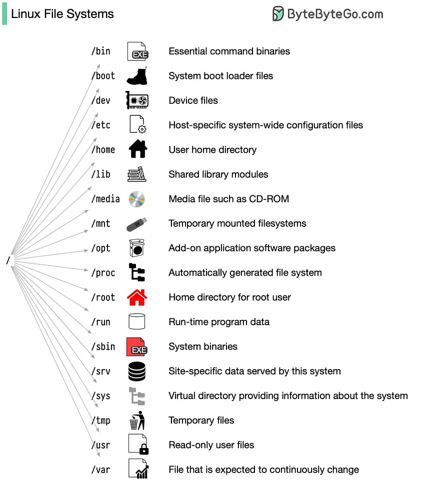

# Session 5
- [Session 5](#session-5)
  - [- recap](#--recap)
  - [agenda](#agenda)
  - [6:40 putty super putty installation](#640-putty-super-putty-installation)
  - [19:32 winscp installation](#1932-winscp-installation)
  - [21:34 installation and start ,enable nginx in aws linux](#2134-installation-and-start-enable-nginx-in-aws-linux)
    - [nginx configuration and hosting a static website](#nginx-configuration-and-hosting-a-static-website)
    - [29:26 Attaching existing domain to existing ip](#2926-attaching-existing-domain-to-existing-ip)
    - [31:30 servers](#3130-servers)
  - [33:10 Linux file system directory structure](#3310-linux-file-system-directory-structure)
  - [46:01 reality of devops projects](#4601-reality-of-devops-projects)
    - [49:45 setting putty session to no timeout](#4945-setting-putty-session-to-no-timeout)
  - [1:01:34 Symlink vs Hardlink](#10134-symlink-vs-hardlink)
    - [Hardlink](#hardlink)
    - [you can create a group of commands for easy management, command aliases](#you-can-create-a-group-of-commands-for-easy-management-command-aliases)

## - recap 
## agenda
## 6:40 putty super putty installation
## 19:32 winscp installation
## 21:34 installation and start ,enable nginx in aws linux
### nginx configuration and hosting a static website  
copy a static website and copy it to server nginx location using winscp  
if you are facing permission issue chmod the dir of html for others and object of others  
Restart the nginx service once the files are copied  

location of files is `/usr/share/nginx/html/`

### 29:26 Attaching existing domain to existing ip
you can buy from hostinger

30:17 loading website changes
### 31:30 servers
front end servers - hosts what users see
backend servers - 8080 , apache , nginx, java , .net ,python

frontend engineers write html to make api calls

## 33:10 Linux file system directory structure

[Linux file system explained](https://www.linkedin.com/posts/bytebytego_systemdesign-coding-interviewtips-activity-7170676995171807232-uBSH?utm_source=share&utm_medium=member_desktop)

## 46:01 reality of devops projects
**Learn properly , there are a lot of projects in migration , if you are skilled enough to industry standard you will get a job, iƒ there is error, read, research, understand, resolve**
### 49:45 setting putty session to no timeout

`/` --> root folder for liux server
`boot` --> when server is getting started, server refers this directory and config from grub.cfg    
`dev` --> devices --> external devices are mounted here    
`etc` --> extra configuration    
`home` --> users home directory are created here    
`lib/lib64` --> system needs libraries    
`/media` --> cd/dvd drive    
`/mnt` --> extra disks mount here    
/opt --> optional , manual installation of services or applications will be downloaded here    
/proc --> running process will store here with their PID    
`/proc/cpuinfo `- cpu info   
`/proc/meminfo` - process info    
/root --> root user home folder    
/run --> when server starts, server uses this directory as storage    
/bin --> cat,vim, touch, cd    
/sbin --> system commands like root access commands    
/tmp --> temp files, not important    
/usr --> all users,    
/var --> variables --> log files,    

## 1:01:34 Symlink vs Hardlink
**V. important**

Domain (google.com) is not understand by computer, system can only understand numbers    
when we type `ping google.com` it fetches the ip address    

storage

storage contains memory locations
when a file is created it points to memory location
these memory location are called inode
inode is representation for file and directory inside memory

checking inode

touch hello

`ls -li` contains memory location when we open file it opens the memory location
symlink - similar to shortcut in windows, it doesn't contain any data but it points to data    
for ex -

create a file hello

`ln -s /home/ec2-user/hello /tmp/hello-soft`
`ln -s sourceFile destinationForLink`

symlink points to actual file 
Symlink will have its own inode will not be same as file inode

### Hardlink

Hardlink points to inode of a file but symlink will point to file 

creating hardlink
`ln /home/ec2-user/hello hello-hard`

simlink will be red in color if we delete file
hardlink works even if source is deleted

inode will be only deleted only when all hardlinks are deleted to that memory location 

A file in the file system is basically a link to an inode.
A hard link, then, just creates another file with a link to the same underlying inode.

When you delete a file, it removes one link to the underlying inode. The inode is only deleted (or deletable/over-writable) when all links to the inode have been deleted.

A symbolic link is a link to another name in the file system.

Once a hard link has been made the link is to the inode. Deleting, renaming, or moving the original file will not affect the hard link as it links to the underlying inode. Any changes to the data on the inode is reflected in all files that refer to that inode.

Note: Hard links are only valid within the same File System. Symbolic links can span file systems as they are simply the name of another file.

[symlink vs hardlink](https://stackoverflow.com/questions/185899/what-is-the-difference-between-a-symbolic-link-and-a-hard-link)

about 'do not understand the use of a **hard link',* it can be used in build systems which do lot of copying of binaries. Creating hard link instead of actual copy speeds things up. MSBuild 4.0 supports this.**

The different semantics between hard and soft links make them suitable for different things.

Hard links:

    indistinguishable from other directory entries, because every directory entry is hard link
    "original" can be moved or deleted without breaking other hard links to the same inode
    only possible within the same filesystem
    permissions must be the same as those on the "original" (permissions are stored in the inode, not the directory entry)
    can only be made to files, not directories

Symbolic links (soft links)

    simply records that point to another file path. (ls -l will show what path a symlink points to)
    will break if original is moved or deleted. (In some cases it is actually desirable for a link to point to whatever file currently occupies a particular location)
    can point to a file in a different filesystem
    can point to a directory
    on some file system formats, it is possible for the symlink to have different permissions than the file it points to (this is uncommon)

### you can create a group of commands for easy management, command aliases

about 'do not understand the use of a hard link', it can be used in build systems which do lot of copying of binaries. Creating hard link instead of actual copy speeds things up. MSBuild 4.0 supports this.

linux password is stored in `/etc/shadow` file.