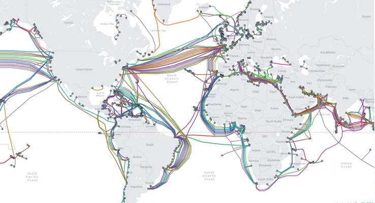
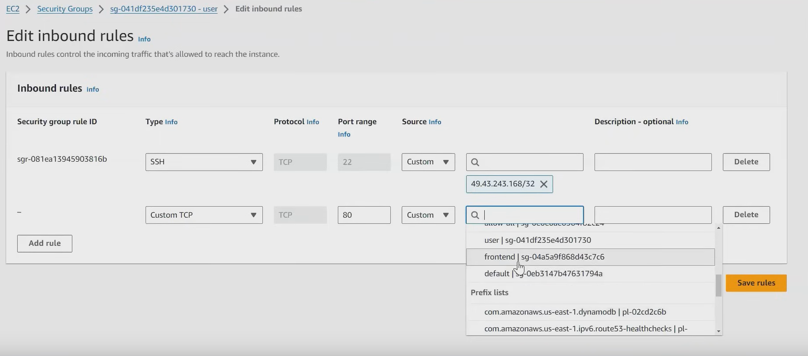

# Session 6

## Public vs Private IP

My Private I: 192.168.1.3 . This is only inside your local network    

My Public IP: 49.43.243.168 . This is the IP address of your internet provider.    

Modem will connect to public ip and then it will assign your private IP to your computer and any connected devices. this translation is handled by NAT    

## NAT
NAT stands for network address translation. It's a way to map multiple private addresses inside a local network to a public IP address before transferring the information onto the internet. Organizations that want multiple devices to employ a single IP address use NAT, as do most home routers.    

Nat is needed because we only have 2^32 = 4,294,967,296 possible addresses.    

## 6.00 How internet is working?

when you are connecting with any other computer in same network(that is connected to same wifi or modem or group of modems in same building) then it is called as **Local Area Network** . while connecting in LAN its suggested to use **private IP address** because of two reasons     
1. it is not accessible from outside.   
2. Its faster because they are in same network  
3. Its more secure because it is not accessible from outside.   
If you choose to use public IP address then it is not recommended because it is not secure (than private ip at least) and it is not fast.    

If you are connecting with any other computer in different network then it is called as **Wide Area Network** . while connecting in WAN its suggested to use **public IP address** because of two reasons     
1. it is accessible from outside.   
2. Its slower because they are in different network 
3. Its less secure because it is accessible from outside.   

8:30 If we want to access resources in same region in aws we should always go with private ip address because of following reasons
1. it is faster
2. it is more secure    
   when you access another resource using public ip when they are in same network because of AWS will count how much data you are transferring using public ip then they will charge you. but if you are doing same thing using private ip then they will not charge you.

How we access internet and DNS resolution works?
When you access facebook.com 

DNS, or Domain Name System, is like the internet's phonebook. It translates domain names (like example.com) into IP addresses (like 192.0.2.1), allowing computers to communicate with each other. Here's how it works:

1. **Request Initiation**: When you type a domain name into your web browser, your device initiates a DNS lookup to find the corresponding IP address. This request is typically sent to your Internet Service Provider's (ISP's) DNS server, but it can also be sent to other DNS servers configured on your network.

2. **Local DNS Cache Lookup**: Your device first checks its local DNS cache to see if it has recently looked up the same domain name. If the IP address is found in the cache and hasn't expired, the request is complete, and the IP address is returned. This caching mechanism helps to speed up subsequent requests for the same domain.

3. **Recursive DNS Query**: If the IP address is not found in the local cache, the request is sent to a recursive DNS server. This server is responsible for finding the IP address on behalf of your device. If the recursive DNS server already knows the IP address, it returns it to your device. Otherwise, it initiates a series of queries to find the IP address.

4. **Root DNS Servers**: If the recursive DNS server doesn't have the IP address in its cache, it starts by querying the root DNS servers. These servers are the starting point for DNS resolution and provide information about the authoritative DNS servers for each top-level domain (TLD) on the internet.

5. **TLD DNS Servers**: Based on the information from the root DNS servers, the recursive DNS server queries the TLD DNS servers responsible for the specific domain extension (like .com, .org, .net). The TLD DNS servers provide information about the authoritative DNS servers for the domain.

6. **Authoritative DNS Servers**: The recursive DNS server then queries the authoritative DNS servers for the domain. These servers hold the definitive records for the domain, including the IP address associated with the requested domain name.

7. **IP Address Response**: Finally, the authoritative DNS servers respond to the recursive DNS server with the IP address associated with the requested domain name. The recursive DNS server caches this information and sends it back to your device, which then uses the IP address to connect to the desired website or service.

Throughout this process, DNS uses a combination of UDP (User Datagram Protocol) and TCP (Transmission Control Protocol) for communication between DNS servers and devices, depending on the requirements of the query and the size of the response.

below is the submarine cable map

## 19:00 Security Groups

## 19:57 Monolithic vs Microservices

long back the project is only one file and it is monolithic.
EAR file is a monolithic file.
Monolithic architecture is a single application that is built as a single unit.

in monolithic even if we want to make a small change in application we have to rebuild the whole application.
the problem with monolithic architecture is that it is difficult to scale the application.
Also the changes has to follow below process.

The change management team will document the changes
Dev-> QA -> UAT -> Production.

Servelets will connect with db
JSPs will be UI -->html
Servlets will be business logic

if i have front end backend and db server

when i want to make a small ui change i cam make it to frontend server

Microservices architecture is a collection of small, independent applications that work together.
it will have layers like frontend, backend, db. Front end can be a web app, mobile app, desktop app, etc.

## 30:44 Backend

1 file --> user, cart, products, payment, order, dispatch

If there is any issue in above modules they will do not affect the other the change is made to only that module for ex products got more load

products related code need to be changed..    
it might take a month to do a small change and only few people will be active in working on change while others just understanding the changes     
                  

a single failure in monolythic will cause --> total failure

java/.net

Microservices
---------------

maintenance is easy

language can be anything    
user --> 5 java candidates    
cart --> 5 python candidates    
product --> 5 NodeJS candidates    
payment    

individual deployments    
deloyment is easy, scalable, fast, cost effective    
server resources can be less    
autoscaling is very easy    

## 45:19 Security groups
---------------

Security groups are a feature provided by cloud computing platforms like Amazon Web Services (AWS) and are used to control traffic to and from instances (virtual servers) or resources within a specific network. They act as a virtual firewall that controls inbound and outbound traffic based on rules defined by the user.

Here's how security groups work:

1. **Inbound Rules**: You can specify inbound rules that control the traffic allowed to reach your instances/resources. These rules typically include protocols (e.g., TCP, UDP), port numbers, and IP ranges (CIDR blocks). For example, you might allow inbound traffic on port 80 (HTTP) from any IP address to enable web server access.

2. **Outbound Rules**: Similarly, you can define outbound rules that control the traffic allowed to leave your instances/resources. Outbound rules specify protocols, port numbers, and destination IP ranges. For example, you might allow outbound traffic on port 443 (HTTPS) to any destination for secure communication.

3. **Default Deny**: By default, security groups have a "default deny" stance, meaning that all inbound and outbound traffic is blocked unless explicitly allowed by defined rules.

4. **Stateful Filtering**: Security groups are stateful, meaning that when you allow inbound traffic for a particular connection (e.g., a response to an HTTP request), the return traffic for that connection is automatically allowed, regardless of the outbound rules. This simplifies rule management and reduces the risk of misconfigurations.

As for the most commonly used ports, it depends on the specific use case and the services running on the instances. However, some ports are more commonly used than others:

1. **HTTP (port 80)**: Used for unencrypted web traffic.
2. **HTTPS (port 443)**: Used for encrypted web traffic.
3. **SSH (port 22)**: Used for secure remote access to servers.
4. **FTP (port 21)**: Used for file transfer.
5. **SMTP (port 25)**: Used for sending email.
6. **DNS (port 53)**: Used for domain name resolution.
7. **RDP (port 3389)**: Used for remote desktop connections on Windows servers.
8. **MySQL (port 3306)**: Used for MySQL database connections.
9. **PostgreSQL (port 5432)**: Used for PostgreSQL database connections.
10. **SMTPS (port 465)**: Used for secure SMTP email transmission.

These are just a few examples, and the actual ports used depend on the specific applications and services running on your instances. It's important to configure your security groups to allow only the necessary ports and protocols to minimize the attack surface and enhance security.

## 47:41 creating the two servers and attaching them

create frontend_SG and ##
alllow http and ssh

remove all / public sg and attatch frontend_SG to instance

start nginx and verify

## 52:00 create User_SG and allow all but no ports

create a server with amazon linux

launch the instance

we cannot connect to user because we dont have ssh to it

all frontend apps --> use port 80
backend apps --> use port 8080 -->

 imagine if we give all access to port 8080 --> we can access all the backend apps its a security issue
## telent
to check connection between servers

telnet <destination-IP> port

telnet 3.208.3.54 8080

install telnet if not available 

it shows connection refused because there is no application running on port 8080    

install nginx and start in user server since all traffic is allowed for server user anyone can connect this causes security issue, no public user should be able to access servers behind the front end

to fix this change only fontned server can connect by changing the security group to only allow security group of frontend

## 01:01:29 Securing security group of a backend server

**I selected frontend SG in USER SG**

## 1:03:50 how do you secure your firewalls
 we will accept connections from only required instances
 \

**1:04:20** debugging using telnet and checking connection from frontend to user server
**1:06:30**
within the network if we use public ip we wont be able to connect using public ip and the rules will not work properly 

connect with telnet with private ip of user server in frontend server it will work

in future we disable public ip of internal servers making the server secure

## project architecture

## Networking videos
you can check networking videos by  Ravindrababu Ravula [networking sessions](https://www.youtube.com/watch?v=bCbkIJwjvtI&list=PLEbnTDJUr_If_GCGDEOYensUC5Ur-L9MR&pp=iAQB)

in a project we have multiple modules handled by different teams

1. products --> heavy load --> wipro

2. user --> they want add to wishlist --> HCL

3. payment --> less load --> TCS

All data will be in Json . thats all is important between modules

I selected frontend SG in USER SG

telnet <destination-IP> port

telnet 3.208.3.54 8080
## inbound and outbound 1:24:15
inbound --> incoming traffic
outbound --> outbound --> traffic originates from our server

## pramod notes 

55:36 we created a prate web server with user 
and pubic web server which is front FrontEnd

to connect with a webserver in same network we can use telnet

## Summary

create 2 instances
    .frontend Server which allows all traffic  
        frontend SG all traffic inbound ports 22 ,80
        this has nginx and telnet installed to connect with user server by using private ip address

    user server which allow Frontend SG with port 80 and port 22 for your ip address
        this will have nginx server installed 
## roboshop documentation
https://github.com/daws-76s/roboshop-documentation

