# 7 Roboshop project configuration

Mettkom technologies - want to bring reform the in the education

Roboshop configuration - [documentation](https://github.com/daws-76s/roboshop-documentation)
- web or frontend tier
- app/ api/ backend tier
- database tier

## architecture of roboshop

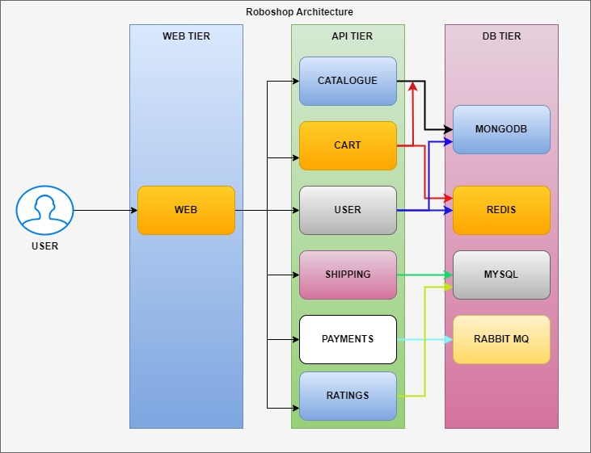

mongoDB is maingly used for bigdata and dealing with large data sets

Redis cahche db
My sql rdbms
rabbit mq is a message broker and queue kind of db

user hits the web tier

api layer can use multiple programming lang such as python, ruby, java, go, etc

DB is more crucial as we can bring up other instances or servers , but if db is lost and there are no backups , no one knows who placed the orders and payment status , balance in account etc . the whole business goes down

# What is the difference between stateful and stateless?
## stateful
    A stateful application is a type of software program or system that maintains information about the state of its interaction with each user or entity. In other words, it remembers the data from previous interactions and uses it to influence future interactions. This contrasts with stateless applications, which treat each request as an independent transaction and do not retain any information about previous interactions.

Stateful applications are commonly used in scenarios where it's necessary to maintain a continuous session with users, such as in web applications that require users to log in and maintain a session state as they navigate through various pages. Examples of stateful applications include online shopping carts, webmail applications, and social media platforms.

One challenge with stateful applications is managing the state across distributed systems, especially in scenarios where multiple instances of the application are running concurrently. Techniques such as session affinity, where requests from the same client are routed to the same server, and distributed caching can help address these challenges.

Overall, stateful applications provide benefits such as personalized user experiences and efficient use of resources by retaining context between interactions, but they also require careful management of state to ensure scalability, reliability, and consistency.

## stateless
    A stateless application is a type of software program or system that does not maintain any information about the state of its interaction with each user or entity. In other words, it treats each request as an independent transaction and does not retain any information about previous interactions. This contrasts with stateful applications, which maintain information about the state of its interaction with each user or entity.

Stateless applications are software programs or systems that do not maintain any information about the state of their interactions with users or entities between requests. Each request is treated as an independent transaction, and the application does not rely on any previous interactions to process the current request.

In stateless applications, all the necessary information to process a request is contained within that request itself. This means that the server does not need to store any session data or context between requests. As a result, stateless applications are inherently more scalable and easier to distribute across multiple servers because any server can handle any request without relying on specific state information.

Stateless architectures are commonly used in modern web development, especially in RESTful APIs (Representational State Transfer) where each request from a client contains all the information needed for the server to process it. Stateless applications are also favored in microservices architectures, where each service is designed to be independent and stateless, communicating with other services via well-defined APIs.

Some benefits of stateless applications include improved scalability, easier load balancing, simpler recovery from failures, and better support for caching and content delivery networks (CDNs). However, designing stateless applications requires careful consideration of authentication, authorization, and data consistency across distributed systems, as these aspects cannot rely on session state.

## stateful and stateless explanation for kids

Alright! Imagine you have a toy box. In a stateful game, you keep adding toys to your box, and every time you play, you remember which toys are already inside. So, you build upon what you've done before. But in a stateless game, every time you play, you start fresh, as if you're opening your toy box for the first time. You don't remember what toys you played with before because you're starting from scratch each time. Stateful is like building a tower block by block, remembering each block you've added. Stateless is like drawing a new picture on a blank sheet of paper every time, without remembering what you drew before.

### examples

DB apps are stateful.
Web/ app are stateless.

## CRUD operations explanation
DB operations are CRUD operations.

Create - Create a new record in the database.
Read - Read a record from the database.
Update - Update a record in the database.
Delete - Delete a record from the database.
examples:
Create User
Read User
Update User
Delete User

DB reading must be quick otherwise there will be latency. So, we need to cache the data usually.
This is handled by developers.

## configuring the app 11:10
    use documentation for installation.
### installing web server 12:00
    we use nginx as a reverse proxy
    We use Centos - AMI name devops-practice in us-east-1 region choose the below ami

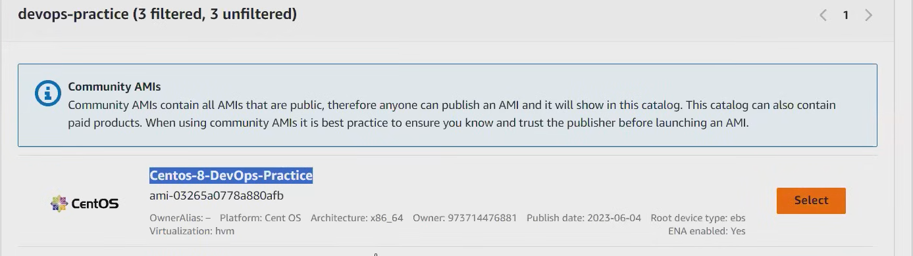

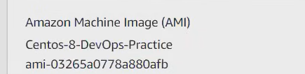

credentials for the above ami is username - centos password - <DevOps321>
this ami uses username and password to authenticate the user instead of using ssh keys.
choose default network 
create a firewall rule to allow all traffic traffic.
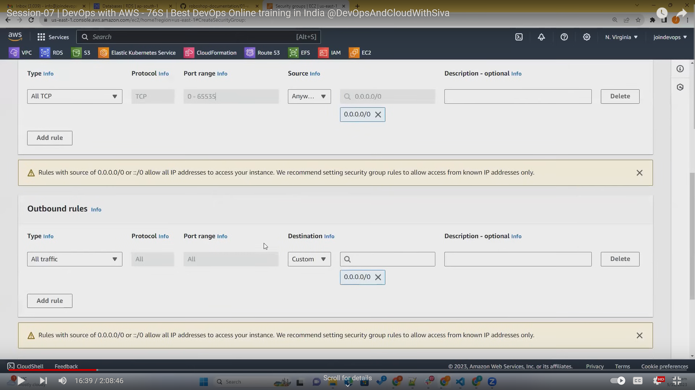
18:00 for the installation of web server.

19:00 using of super putty

nginx is one of the popular webservers which runs on default port 80

## Forward proxy vs reverse proxy 

## dnf vs yum

`dnf` and `yum` are both package managers used in Linux distributions, particularly in RPM-based distributions like Fedora, CentOS, and Red Hat Enterprise Linux (RHEL). Here's a comparison between the two:

1. **dnf (Dandified YUM)**:
   - DNF is the next-generation package manager that aims to improve upon the functionality of `yum`.
   - It features better performance, dependency resolution, and a more user-friendly interface compared to `yum`.
   - DNF uses the libsolv library for dependency resolution, which is faster and more accurate.
   - It has more advanced features like parallel downloading of packages, automatic RPM transaction history, and a modular design.

2. **yum (Yellowdog Updater Modified)**:
   - Yum was the traditional package manager used in RPM-based distributions before DNF.
   - It's still widely used and supported, especially in older versions of CentOS and RHEL.
   - Yum has a simpler interface compared to DNF and may be preferred by some users who are accustomed to its commands and behavior.
   - Yum's development has slowed down in favor of DNF, and it's recommended to migrate to DNF for better performance and features.

In summary, while both `dnf` and `yum` serve the same purpose of managing packages in RPM-based Linux distributions, `dnf` is the recommended choice for most users due to its improved performance and features. However, `yum` is still used and supported, particularly in older systems where migration to `dnf` might not be feasible or necessary.

### connecting to server
23:23

check using `netstat -lntp`
24:00 debugging the connection

check the firewall using `firewall-cmd --list-all` if you believe its blocked by firewall

open http server not https because we don't have https yet

'/etc/nginx' you can see where error log an access log is saved

where the html pages are saved

25:00

nginx config file is in '/etc/nginx/nginx.conf'

nginx html directory is `usr/share/nginx/html`

deleting files of default nginx 
`rm -rf /usr/share/nginx/html/*`

download the front end content `curl -o /tmp/web.zip https://roboshop-builds.s3.amazonaws.com/web.zip`

curl vs wget
------------
curl is a command line tool that can be used to transfer data from or to a server, using one of the supported protocols (DICT, FILE, FTP, FTPS, GOPHER, HTTP, HTTPS, IMAP, IMAPS, LDAP, LDAPS, POP3, POP3S, RTMP, RTSP, SCP, SFTP, SMB, SMBS, SMTP, SMTPS, TELNET and TFTP).

wget is a command line tool that can be used to download files from the web.

Extract the frontend content.

cd /usr/share/nginx/html

unzip /tmp/web.zip

Create Nginx Reverse Proxy Configuration.

vim /etc/nginx/default.d/roboshop.conf 

forward proxy vs reverse proxy 29:24
-------------------------------------
forward proxy is a proxy server that forwards requests to another server.    
VPN --> virtual private network we use for secure access to the internet and directing traffic to another server    

below is the image of how vpn works    

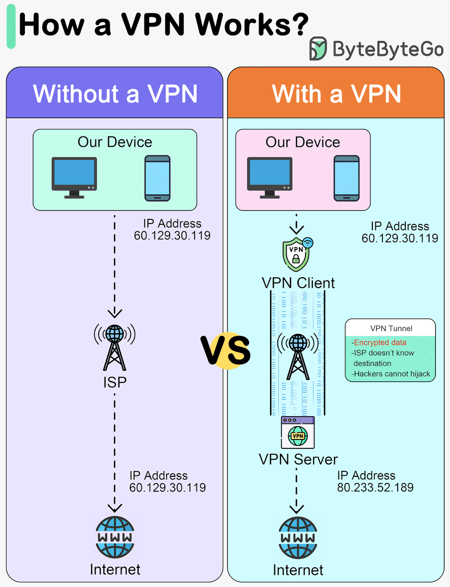

Servers are not aware of clients are behind VPN
anonymous access --> hiding our identity

Forward Proxy 
-------------------------------

Request --> forward proxy --> server <--> response

browser connects to the proxy server , so proxy protects the user data Apps cannot see who is accessing.

This is usually to filter data to protect the user privacy and filter the content.

clients are aware of server side
apps use forward proxy to secure their code
forward proxies can't understand real clients

reverse proxy
-------------------------------
clients are not aware of server side
apps use reverse proxy to secure their code
load balancing
 
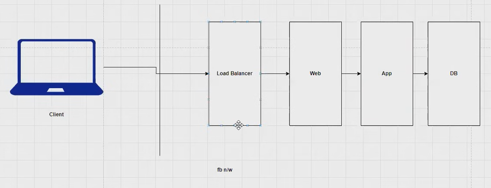

### Forward Proxy vs Reverse Proxy: Real-Time Examples

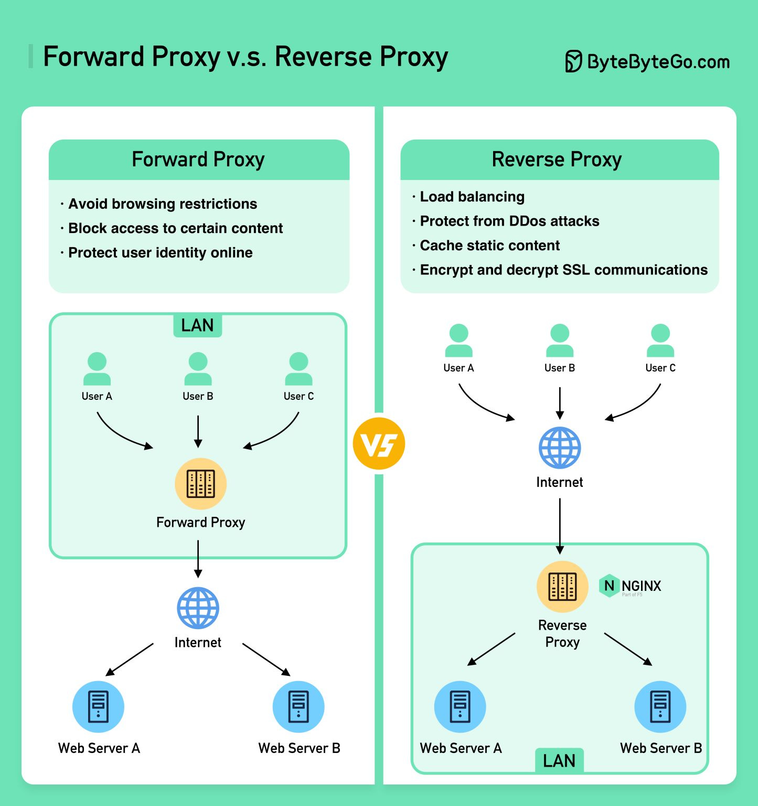

Imagine you and a library:

    Forward Proxy (You and a Librarian):
        You want to borrow a book, but the library website is blocked at your school.
        You visit the librarian (the forward proxy) first.
        The librarian checks the library catalog (the internet) on your behalf and retrieves the book (the data).
        The librarian hands you the book (the data), without revealing your identity to the library website.
        This helps you access blocked content (the book) anonymously.

    Reverse Proxy (Library Website and Staff):
        You search for a book on the library website.
        The website (the reverse proxy) acts as a middleman between you and the library's actual servers (multiple book catalogs).
        The website might check a local cache (remembered searches) first to see if it has the information you need.
        If not, it forwards your request to the most appropriate server (the relevant catalog) based on factors like location or availability.
        The server sends the book information back to the website.
        The website tailors the information (formats it for the website) before delivering it to you.
        This improves performance (caching) and security (website as a gatekeeper).

In essence:

    Forward Proxy: Acts for the client, hides client identity, improves privacy or access.
    Reverse Proxy: Acts for the server, improves server performance and security.

Nginx configuration
----
40:51 copy nginx config of roboshop

**always restart after changing the config** 

inspect the error and see that it is a 404 error.
http://54.197.5.96/api/catalogue/categories --> querying catalogue to know the product categories

HTTP status
--------------------
2** --> success
3** --> redirect/temp --> images, gifs are redirected

failure responses
-----------------
400, 404, 403, 402

4** --> client side error
5** --> server side error --> purely project error

`200` OK: This is the most common status code and indicates that the request was successful.
`301` Moved Permanently: This code tells the browser that the requested page has been moved to a new location permanently.

`302` Found (Temporary Redirect): This code indicates that the requested page has been moved to a new location temporarily.
`404` Not Found: This code means that the requested page could not be found on the server.
`403` Forbidden: The server understood the request, but is refusing to fulfill it. Authorization will be required.
`500` Internal Server Error: The server encountered an error and was unable to complete the request.

These are just a few of the many HTTP status codes that exist. You can find a complete list of status codes here: search for HTTP status codes.

data is cached in browser from time to time for better performance.

## caching 50:29

Airtel --> 1000 users

1 user downloaded bahubali movie --> server from US since there are lot of requests for same airtel will have a lot of burden.
so airtel uses cache server -->to deliver bahubali movie
because same 
2nd user get from cache server --> more speed

## MongoDB 53:01

use **t3 meidum** as mongodb is heavy with SG allowing all traffic

all repos are stored in `cd /etc/yum.repos.d/`

59:51 as mongodb is not available in default repos, we will add it manually

check if mongod is up or not and check 27017 is up

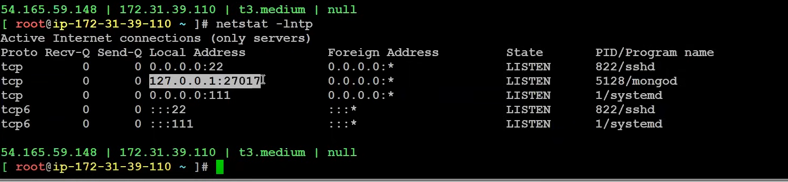
if you seee mongodb is running on localhost:27017 so it will only accept requests from localhost not from other servers, we will send request from app tier so we will change configuration in `/etc/mongod.conf`

change connections address to the below 
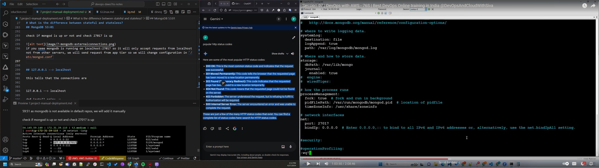

check using `netstat -lntp`
## 127.0.0.1 --> localhost
Localhost refers to a special hostname that directs your computer to communicate with itself. It acts like a loopback mechanism, meaning any request sent using "localhost" stays on your machine and isn't routed to the wider internet. Here's why it's significant:

    Testing Ground:  Web developers frequently use localhost to test websites and applications they're building. By hosting the website files on their computer and accessing them through localhost in a web browser, they can simulate a real-world experience in a private environment. This allows them to identify and fix bugs without exposing unfinished work to the public.

    Security:  Since localhost communication stays within your device, it offers a secure testing zone. Developers can experiment with code changes or run programs without the risk of unintended data exposure on a public server.

    Virtual Server: Localhost essentially transforms your computer into a virtual server. This is beneficial for running server-side applications or databases on your machine for development or learning purposes.

In essence, localhost provides a safe and isolated environment for developers and users to test, run, and explore various programs and applications before they go live on the internet.

## catalogue installation 1:05:10

create a t2.micro and allow all in SG

1:08:00 developer asked to install us to install a specific version so disable the old version and enable new version 1:09:08

1:11:23 when application is created by developers they will use dependencies to avoid developing from scratch

this is what npm install means - npm will install the packages or libraries that are already implemented

as we have package.json, npm install will download packages from internet
1:13:40
this tells that the connections are 
check dir  `cd etc/systemd/system/` for nginx.service

search for the file with name start using nginx using find command in /etc/systemd/system/ directory

find . -name "*nginx*"
this will show nginx files 

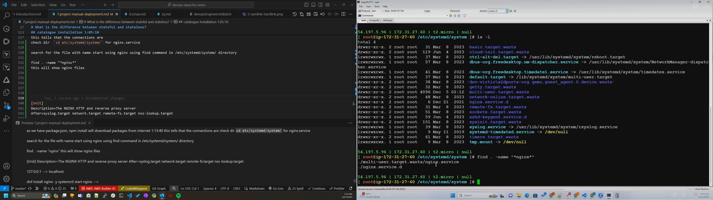

creating custom systemctl service to create a service 1:15:00
----

** always give private ip address between servers**

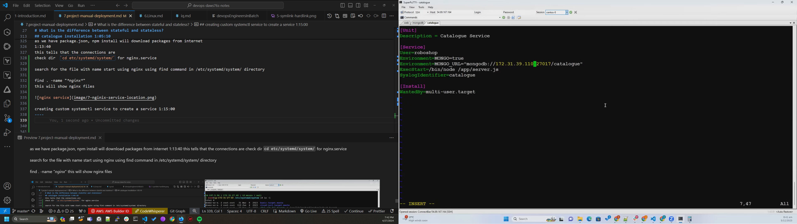

1:17:20

once the url of mongo db is updated reload the deamon by `systemctl daemon-reload` 

## tail command 1:17:38    
to check running logs `tail -f /var/log/messages`

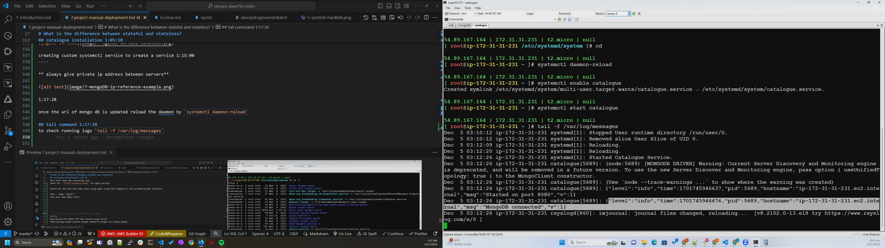    

1:18:22 configuration change

go to web server and open reverse proxy configuration file from location `vim /etc/nginx/default.d/roboshop.conf`

update private ip in file and restart nginx service `systemctl restart nginx`

debugging 1:19:42 because the mongodb data is not showing as categories on front end

the data is not loaded so you need to load data for the first time

We need client to access data in mongodb server 

to check logs use `tail -f /var/log/messages` in catalogue server

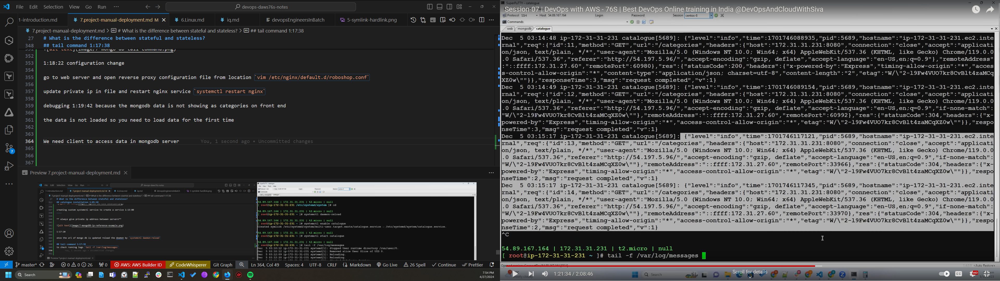

## 1:21:59 installing mongodb client

1:22:49 loading catalogue JS

restart the catalogue after loading data by `systemctl restart catalogue`

## Reverse proxy

## caching

## DB configuration - MONGODB

## Catalogue module

## Assignment

HTTP codes
Forward proxy vs Reverse proxy
configure our project

## AMI auth credentials

devops-practice
centos/DevOps321

## Qeustions 1:24:00 
