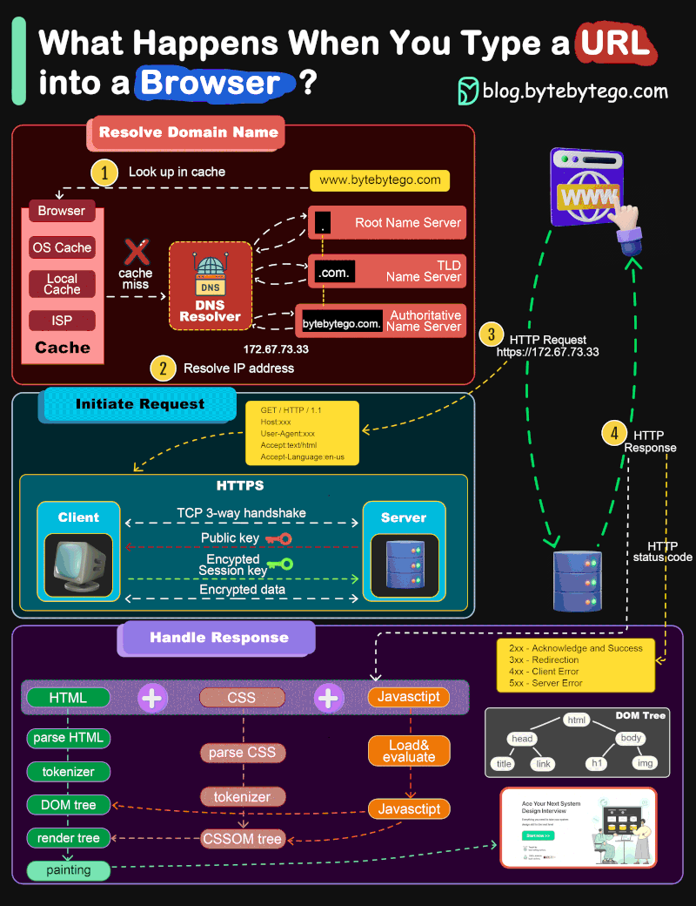
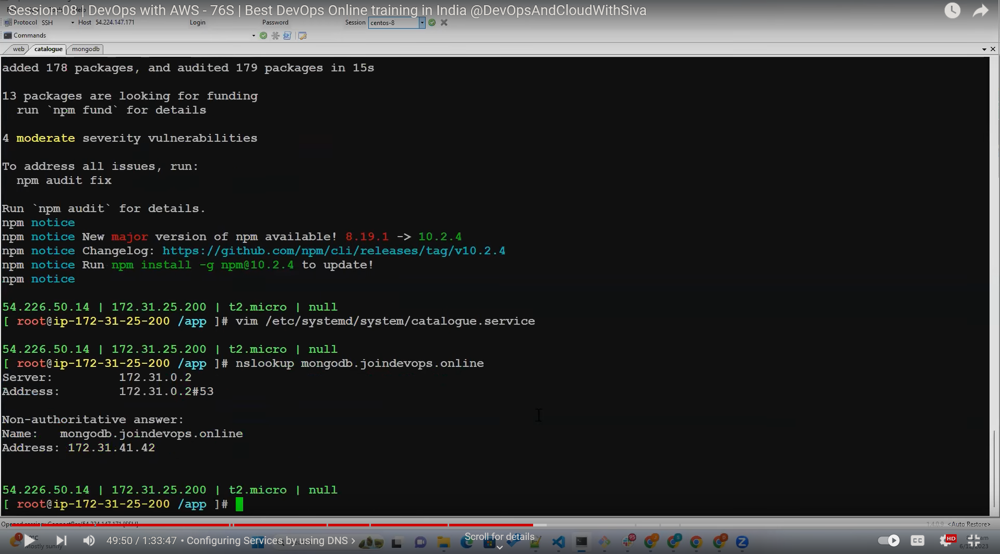
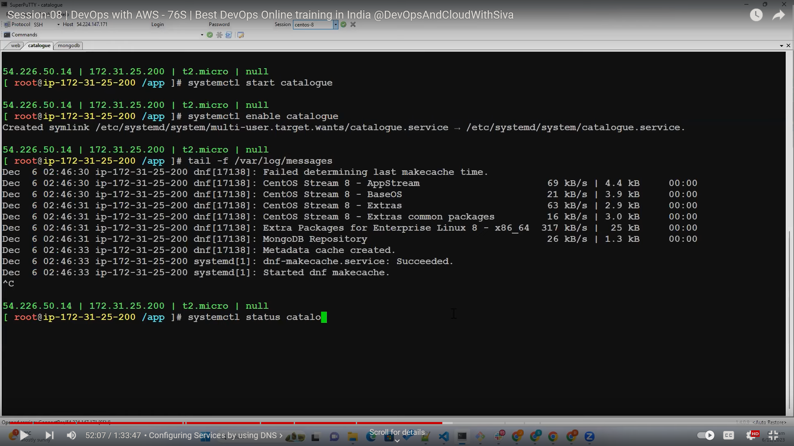
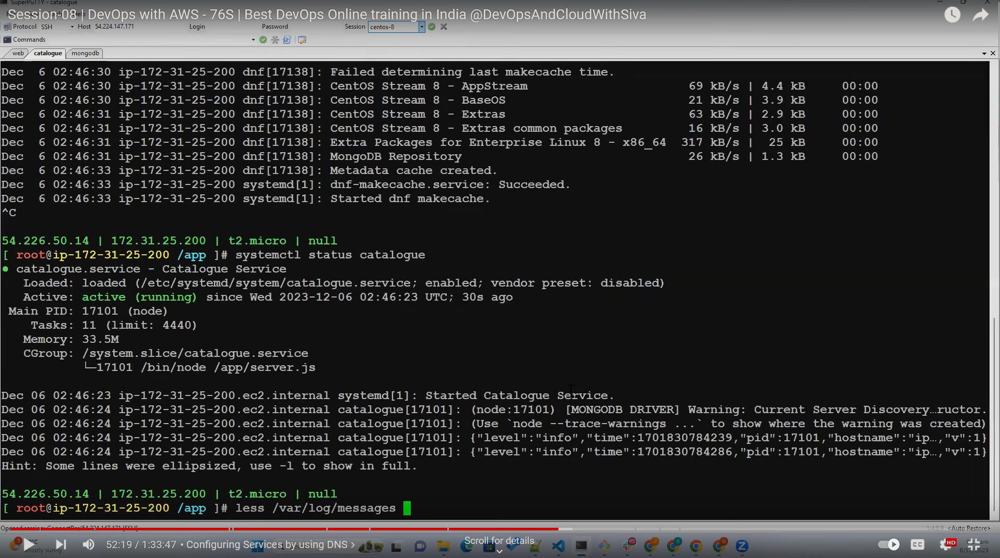

# Session 8 - manual deployment of roboshop server
- [Session 8 - manual deployment of roboshop server](#session-8---manual-deployment-of-roboshop-server)
  - [00:00 - Recap](#0000---recap)
  - [02:48 - Web](#0248---web)
    - [04:00 catalogue -t2.micro](#0400-catalogue--t2micro)
  - [04:52 config of web instance](#0452-config-of-web-instance)
  - [07:58 - DNS - Domain name system](#0758---dns---domain-name-system)
  - [The DNS System Explained: Journey to Facebook.com](#the-dns-system-explained-journey-to-facebookcom)
  - [15:01 TLD](#1501-tld)
  - [20:56 - Domain Registrars](#2056---domain-registrars)
  - [Domain Registrars: The Gatekeepers of Your Online Identity](#domain-registrars-the-gatekeepers-of-your-online-identity)
  - [21:07 - Domain Purchase](#2107---domain-purchase)
  - [30:08 - Name servers Transferring](#3008---name-servers-transferring)
  - [34:10 - Record Creation R53](#3410---record-creation-r53)
  - [break](#break)
  - [41:40 - Configuring Services by using DNS](#4140---configuring-services-by-using-dns)
    - [44:00 - configuration of mongo db](#4400---configuration-of-mongo-db)
    - [46:00 -  configuration of catlogue](#4600----configuration-of-catlogue)
    - [49:22 creating a record for mongodb in hostedzone](#4922-creating-a-record-for-mongodb-in-hostedzone)
    - [50:24 mongodb client software installation to load data](#5024-mongodb-client-software-installation-to-load-data)
    - [51:00 - configuration of mongodb](#5100---configuration-of-mongodb)
    - [52:00 checking logs](#5200-checking-logs)
    - [54:19 updating reverse proxy](#5419-updating-reverse-proxy)
    - [56:00 errors- general](#5600-errors--general)
  - [59:46 - Redis](#5946---redis)
  - [01:02:00 - Assignment](#010200---assignment)
  - [01:03:48 - Student Doubts](#010348---student-doubts)

## 00:00 - Recap
## 02:48 - Web
---
- configuration of web instance 

### 04:00 catalogue -t2.micro

## 04:52 config of web instance 
    install and start nginx 
## 07:58 - DNS - Domain name system
--
## The DNS System Explained: Journey to Facebook.com

Here's a breakdown of how the DNS system works, using your example of accessing facebook.com:

* **Your Browser:**
    * Checks its cache: The browser first looks for the IP address of facebook.com in its own internal cache. This cache stores recently accessed websites for faster future loading.

* **Operating System (OS):**
    * If not in the browser cache, the request goes to your OS.
    * OS cache check: Similar to the browser, the OS might have a cache for recently resolved domains.

* **Internet Service Provider (ISP) Resolver:**
    * If not found in OS cache, the request reaches your ISP's DNS resolver. This is because DNS resolution is typically handled by your ISP.

* **ISP Resolver Cache:**
    * The ISP resolver checks its own cache for the IP address of facebook.com. 

* **Root Servers:**
    * If not in the ISP cache, the ISP resolver reaches out to the root servers. 
      * These are the foundation of the DNS system, acting like a phonebook index.
      * There are 13 geographically distributed root servers, backed by many more for load balancing.

* **Top-Level Domain (TLD) Servers 15.01 :**
    * The root servers don't store actual IP addresses, but rather point the ISP resolver to the appropriate TLD server.
    * In this case, the TLD server responsible is the one managing ".com" domains.
    * There are various TLDs like ".com", ".org", ".in" (India), etc., each managed by a specific server.

* **Authoritative Nameservers:**
    * The .com TLD server provides the information for facebook.com's nameservers. 
    * These nameservers are the authoritative sources for facebook.com's IP address.
    * Domain registrars like GoDaddy or Hostinger often provide nameserver services.

* **Final IP Address:**
    * The ISP resolver contacts facebook.com's nameservers and retrieves the actual IP address for facebook.com.

* **Connection Established:**
    * Finally, the ISP resolver sends the IP address back to your OS.
    * Your browser uses this IP address to connect to the facebook.com server and display the website.

**Additional Notes:**

* This process usually happens very quickly, often in milliseconds.
* Browsers and OS caches can improve website loading speed for frequently visited sites.
* ISP resolvers can also cache DNS records for efficiency.
* Domain registrars manage the registration of domain names and often provide nameserver services.  

## 15:01 TLD
--
A Top-Level Domain (TLD) is the ending portion of a domain name, following the final dot. It acts like a category label for websites, offering a general idea about the nature of the website. Here's a breakdown of TLDs:

* **Function:**
    * TLDs categorize websites based on their purpose, organization type, or geographical location. 
    * They help users understand the nature of a website at a glance. 

* **Examples:**
    * Some common TLDs include:
        * **.com:** Most popular generic TLD for commercial entities.
        * **.org:** Primarily used by non-profit organizations.
        * **.net:** Originally for network-related organizations, now more general.
        * **.gov:** Websites of government entities (e.g., `.gov`, `.in` for India).
        * **.edu:** Educational institutions (e.g., `.edu`).

* **Management:**
    * Different organizations manage various TLDs.
        * The Internet Corporation for Assigned Names and Numbers (ICANN) oversees the overall TLD system.
        * Specific registries manage individual TLDs like ".com" or ".org".
        * For country-specific TLDs (like ".in" for India), the respective country's government or a designated agency is responsible.

* **New TLDs:**
    * Over time, new TLDs are introduced to accommodate various website categories. 
    * Examples include ".shop" for online stores or ".ai" for Artificial Intelligence-related websites.

* **Choosing a TLD:**
    * When registering a domain name, selecting the right TLD is important. 
    * It should reflect your website's purpose and target audience.
    * Popular TLDs like ".com" offer wider recognition, while specific TLDs can attract a more targeted audience.

## 20:56 - Domain Registrars
--
## Domain Registrars: The Gatekeepers of Your Online Identity
------

Domain registrars play a crucial role in the world of websites. They act as the middlemen between you and the vast database of domain names on the internet. Here's a detailed explanation of domain registrars:

**What They Do:**

* **Domain Name Sales:** Domain registrars are essentially retailers for domain names. They offer a platform to search for available domain names and register them for a fee.
* **Registration Process:** When you purchase a domain name through a registrar, they handle the registration process with the relevant domain name registry (explained later). This involves submitting your information, setting up nameservers (explained later), and ensuring you comply with domain name registration policies.
* **Renewal and Management:** Domain names don't last forever. Registrars send reminders for renewal before your domain expires and allow you to manage your domain settings like contact information and nameservers.
* **Additional Services:** Many registrars offer additional services like domain name privacy protection, email hosting, and website builders, sometimes bundled with domain registration.

**How They Work:**

1. **Domain Name Search:** You use the registrar's search tool to find an available domain name that aligns with your website's purpose or brand identity.
2. **Registration:** You choose the desired domain name, provide your contact information, and pay a registration fee. The fee typically covers a year of ownership (although some registrars offer multi-year registrations).
3. **Domain Name Registry:** The registrar interacts with the relevant domain name registry, which is the central database for a specific TLD (Top-Level Domain) like ".com" or ".org". The registry checks for availability and finalizes the registration process.
4. **Nameservers:** You configure your domain's nameservers during registration. These are specialized servers that translate your domain name (e.g., facebook.com) into the corresponding IP address (e.g., 123.456.78.90) that computers understand. Some registrars offer nameserver services, while others allow you to use a third-party provider.
5. **Domain Management:** After registration, you can manage your domain name through the registrar's control panel. This typically allows you to update contact details, renew your registration, manage nameservers, or set up additional services.

**Choosing a Domain Registrar:**

* **Price:** Registration fees and renewal costs can vary between registrars. Consider comparing prices before making a decision.
* **Features:** Some registrars offer additional features like free email addresses, website builders, or domain privacy protection. Choose a registrar based on your specific needs.
* **Reputation:** Look for a reputable registrar with a good track record of customer service and reliability. Online reviews and comparisons can help you choose.

**Important Note:**

* Domain names are not actually "sold" but rather "leased" for a specified period. You'll need to renew your registration to maintain ownership.

By understanding domain registrars, you can effectively navigate the process of securing your unique online address and establishing your website's presence on the internet.

## 21:07 - Domain Purchase
----

## 30:08 - Name servers Transferring
-----

4. **Nameservers:** You configure your domain's nameservers during registration. These are specialized servers that translate your domain name (e.g., facebook.com) into the corresponding IP address (e.g., 123.456.78.90) that computers understand. Some registrars offer nameserver services, while others allow you to use a third-party provider.
 
 - domain registerar's resposibility is to update the name servers for the domain
 - nameservers are undercontrol of dns registerer for ex hostinger
 - if we are using any other service we need to transfer nameservers

## 34:10 - Record Creation R53
----

When we amke a request Broswer > Browser cache > OS > Os cache > ISP > ISP CACHE > ROOT SERVER > TOP LEVEL DOMAIN (TLD) > NAME SERVERS > A RECORDS > IP ADDRESS

buy a domain, if you dont have one , if you have it use it.

update nameservers of aws in hostinger which will be created when hostedzone is created  41:00

## break
## 41:40 - Configuring Services by using DNS
----
Creation of servers and configuration 

### 44:00 - configuration of mongo db 
    enable remote access in mongodb and restart mongodb

### 46:00 -  configuration of catlogue
 create and start service
### 49:22 creating a record for mongodb in hostedzone
    update the record in catalogue
    check catlagoure to mongodb by nslookup mongodb.joindevops.online
Mongo db record creation

### 50:24 mongodb client software installation to load data
load data into server
start and enable catalgoure and check logs by tail command

### 51:00 - configuration of mongodb
create and start service
create record in catalogue
check catalogue to redis by nslookup redis.joindevops.online
Redis record creation

    `tail -f /var/log/messages`

### 52:00 checking logs
checking logs using less command - 
    shift+g to go to end of file
    gg - go up
    q -quit

### 54:19 updating reverse proxy
    update the record in catalogue
    restart the web server (frontend reverse proxy server)

### 56:00 errors- general
- data loading
- restarting
- 
**check last part of video 50:00 to 59:00 to understand the backend debugging**
    
## 59:46 - Redis
redis is a cache server
to check the user while login  we will use redis to speedup the process

Imagine you visit your favorite website.  There are lots of images, text, and formatting that needs to be loaded to show you the entire page. A cache acts like a personal assistant for your device, remembering this information so you don't have to download it all again every time you visit the same site.

Here's why a cache is important:

* **Speeds things up:**  By storing frequently accessed data, the cache can significantly improve loading times for websites and apps.  Instead of waiting to download everything again, your device can just grab it from the cache, which is much faster.
* **Reduces workload:**  Especially for websites with a lot of content, constantly downloading everything would use up a lot of internet bandwidth.  The cache helps by reusing data, which is easier on your internet connection.

In short, a cache is like a mini storage unit on your device that holds onto frequently used information to make things faster and smoother.

## 01:02:00 - Assignment

related links   
[Cache Systems Every Developer Should Know](https://www.youtube.com/watch?v=dGAgxozNWFE)

[Caching Pitfalls Every Developer Should Know](https://www.youtube.com/watch?v=wh98s0XhMmQ)

[Top 7 Ways to 10x Your API Performance](https://www.youtube.com/watch?v=zvWKqUiovAM)

## 01:03:48 - Student Doubts
--

