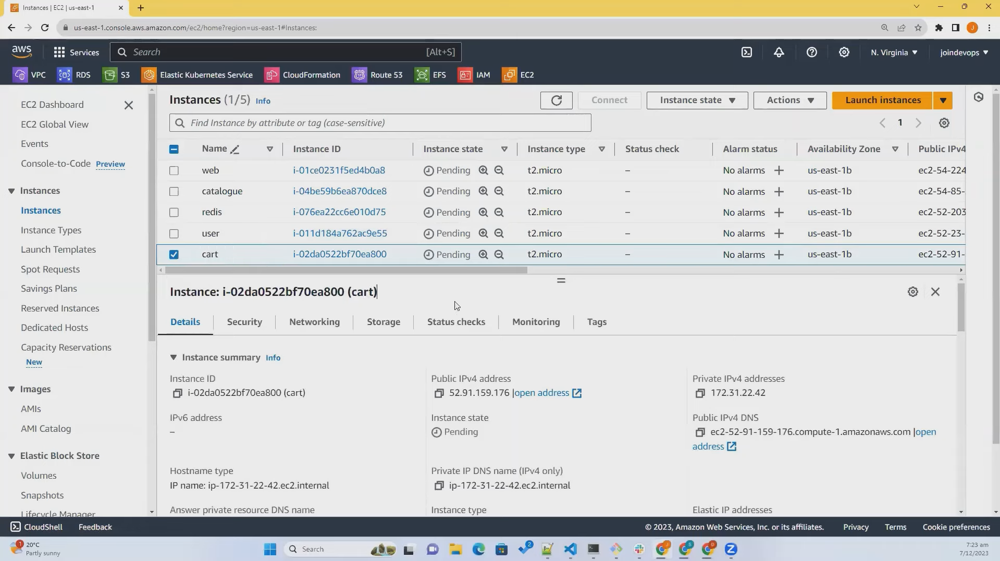
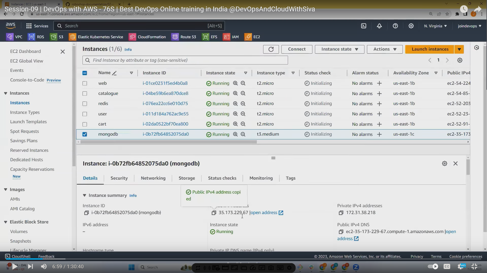
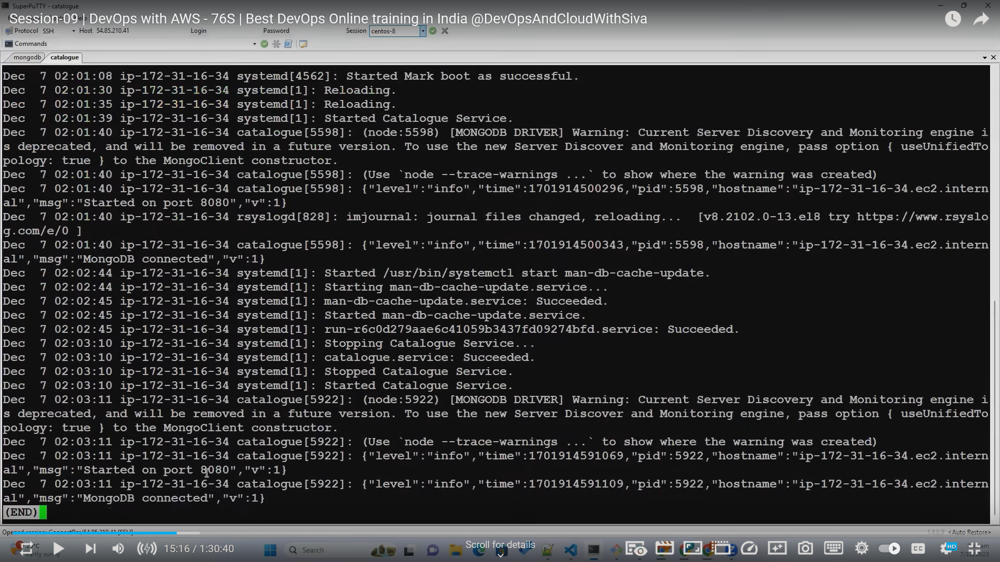
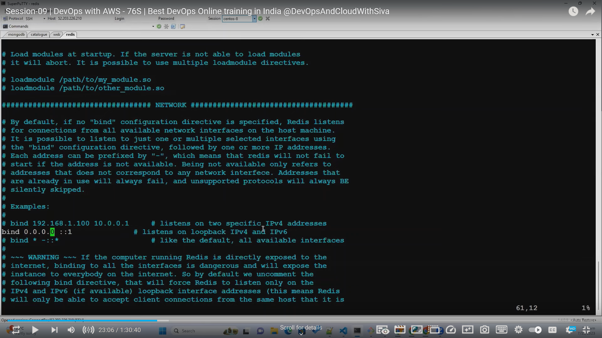

[session -09 ](https://www.youtube.com/watch?v=RaMvxl7mygY)
# session-09
- [session-09](#session-09)
  - [configuration of all servers](#configuration-of-all-servers)
    - [1:23 possibility of errors](#123-possibility-of-errors)
    - [3:14 instance creation 5 t2.micro 1t3.medium](#314-instance-creation-5-t2micro-1t3medium)
    - 
    - [servers required](#servers-required)
    - [5:40 Configuration of the servers](#540-configuration-of-the-servers)
    - [13:17 loading products into db](#1317-loading-products-into-db)
    - [18:10 cart user redis config](#1810-cart-user-redis-config)
    - [18:40 redis config](#1840-redis-config)
  - [Deploying or setting up env in linux](#deploying-or-setting-up-env-in-linux)

## configuration of all servers

### 1:23 possibility of errors
### 3:14 instance creation 5 t2.micro 1t3.medium
### 

### servers required 

### 5:40 Configuration of the servers

use private ip of instances to connect to them in hosted zone

always need public access for front end 
always check after running server   
 - if the service is running and ports are open or not using `netstat -lntp`

**09:50** configuring catalogue

disable default version and enable nodejs version 18

### 13:17 loading products into db
    you can load products into db from either from same server or from different server by connecting to the database

**14:10** loading and restarting products

restart after loading products into db

 **15:00** check logs by using `tail or less` and check if mongo db is connected 

checking logs

 

15:31 configure web and configuration completed at 18:10

### 18:10 cart user redis config 

user and cart dependent on redis

### 18:40 redis config

bind redis to interent

check if the server is running properly using `netstat -lntp`

**25:00** configure user
28:47

32:13 user creatopm

40:17 shipping project

41:00

## Deploying or setting up env in linux

The provided text offers a helpful walkthrough on deploying an application on a Linux server. Here's a breakdown of the process incorporating those details:

**Prerequisites:**

* **Server:** You'll need a Linux server to host the application.
* **Programming Language:** The language the application is built in (e.g., Node.js, Java, Python).

**Steps:**

1. **Install Programming Language:** Ensure the server has the necessary programming language installed (e.g., Node.js for a Node.js application).
2. **Create Directory:** Create a dedicated directory on the server to store the application files.
3. **Create Application User:** Create a separate user account for the application to run under, enhancing security.
4. **Download Application:** Download the application files to the designated directory.
5. **Install Dependencies:** Install any required libraries or packages the application relies on. The package manager for the specific programming language will handle this (e.g., `npm` for Node.js, `pip` for Python).
6. **Create Systemd Service File (Optional):**  For applications meant to run continuously, a systemd service file can be created. This file instructs the system how to start, stop, and manage the application as a service.  This step might not be necessary for all deployments.
7. **Start and Enable Service (Optional):** If a systemd service file was created, use the `systemctl` commands to start the application and enable it to launch automatically on boot.

**Additional Notes:**

* Ifs compiling Java code. While Java code is compiled into bytecode (.class files), this often happens during the development process and isn't a direct step in deployment.
*  For certain languages like Python and Node.js, compilation typically isn't required as they are interpreted languages.

By following these steps, you can effectively deploy an application on your Linux server. Remember, this is a general guideline, and the specifics may vary depending on the application and your environment.

44:05 my sql installation and configuration t3.medium

57:30 shipping service creation
59:02 schema of shipping  and loading data in my sql

1:01:00 check mysql load using show db command 

update web and update roboshop conig file with shipping

1:02:30 journaling service to check error

1:04:05 end of class

     

  